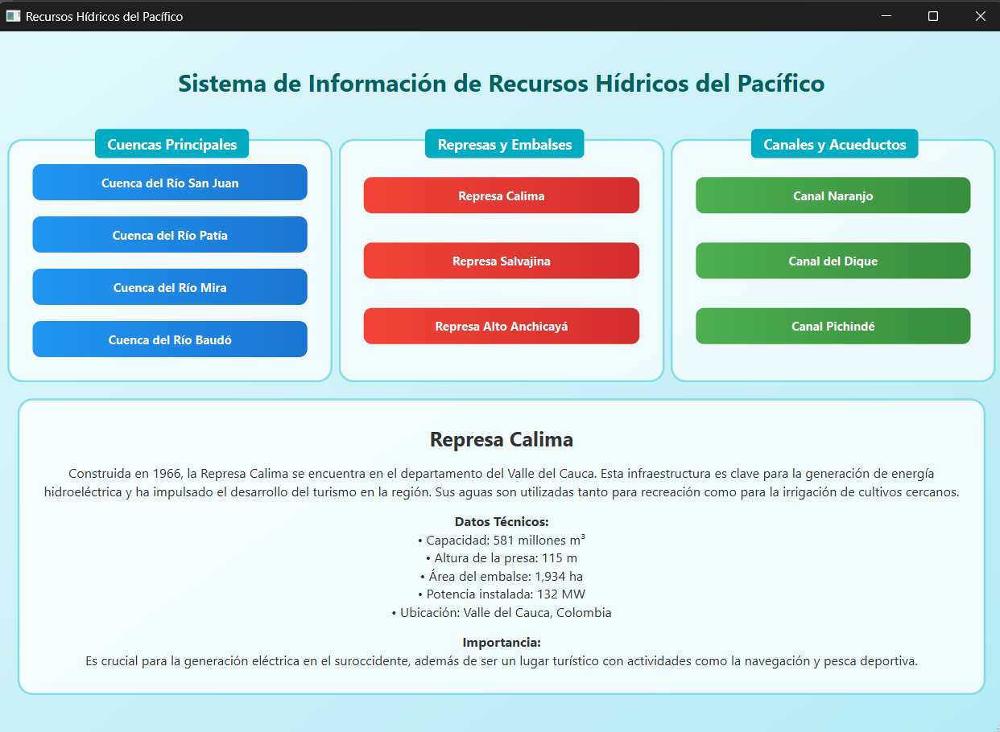

### Informe del Proyecto: Sistema de Gestión de Recursos Hídricos

---

A continuación se presenta una imagen del sistema:

---

#### 1. **Introducción**
El proyecto desarrollado corresponde a un **Sistema de Gestión de Recursos Hídricos** que permite visualizar información sobre distintos tipos de recursos hídricos, como **cuencas**, **represas**, y **canales**, presentes en diversas regiones. El objetivo del sistema es proporcionar una interfaz intuitiva y eficiente para que los usuarios consulten datos técnicos y descripciones de estos recursos, con el fin de promover su conocimiento y correcta gestión.

#### 2. **Funcionalidades Principales**
El sistema tiene las siguientes funcionalidades:
- **Visualización de Recursos Hídricos**: Permite la consulta de información detallada de cuencas, represas y canales.
- **Interacción con el Usuario**: Se facilita la selección de recursos a través de botones y se muestra la información asociada al recurso seleccionado.
- **Búsqueda y Filtrado de Recursos**: Los recursos pueden ser filtrados por tipo y nombre, mostrando los datos correspondientes de manera estructurada.

#### 3. **Componentes Técnicos**
##### 3.1 **Estructura del Código**
El sistema está basado en **Qt**, utilizando C++ como lenguaje de programación. Se sigue un diseño basado en el patrón **señal-slot** para gestionar la interacción entre los componentes de la interfaz y la lógica del sistema.

- **`mainwindow.cpp`**: Contiene la lógica principal para la interacción de la ventana principal, configuración de señales y slots, y la inicialización de los recursos.
- **`mainwindow.h`**: Define la clase `MainWindow` y los métodos para configurar conexiones, mostrar información de recursos y buscar recursos por nombre y tipo.
- **`RecursoHidrico`**: Clase que representa un recurso hídrico, almacenando información como nombre, tipo, descripción, datos técnicos e importancia del recurso.

##### 3.2 **Interfaz de Usuario**
- **QPushButton**: Se utiliza para representar los diferentes recursos hídricos (cuencas, represas y canales) en la interfaz.
- **QLabel**: Para la visualización de la información de los recursos seleccionados.
  
#### 4. **Metodología**
Se siguió la metodología ágil de desarrollo en pequeñas iteraciones:
1. **Inicialización del proyecto**: Configuración de la interfaz gráfica usando Qt Designer.
2. **Programación de funcionalidades**: Implementación de la lógica para manejar la selección de recursos y mostrar la información en tiempo real.
3. **Pruebas**: Se realizaron pruebas unitarias para verificar la correcta integración de la interfaz con la lógica de negocio.

#### 5. **Resultados**
Se implementaron y probaron los siguientes resultados:
- **Interfaz gráfica interactiva**: Los usuarios pueden seleccionar distintos recursos hídricos a través de botones organizados por categorías.
- **Visualización clara y concisa**: Se muestra información detallada de cada recurso hídrico seleccionado, como el nombre, descripción, datos técnicos e importancia.
- **Optimización de la búsqueda**: La función de búsqueda por nombre y tipo permite encontrar un recurso de manera rápida y precisa.

#### 6. **Conclusiones**
El **Sistema de Gestión de Recursos Hídricos** desarrollado cumple con los objetivos propuestos, proporcionando una herramienta útil para la consulta de información técnica de recursos hídricos. Además, la implementación basada en señales y slots asegura una interacción fluida entre la interfaz de usuario y la lógica del programa.

#### 7. **Recomendaciones**
Para futuras mejoras, se recomienda:
- **Ampliar el sistema** con más tipos de recursos hídricos.
- **Agregar capacidades de filtrado avanzadas**, permitiendo búsquedas más específicas basadas en atributos adicionales como ubicación geográfica o caudal.
- **Integrar gráficos o mapas** que representen de forma visual la localización de los recursos seleccionados.

#### 8. **Anexos**
##### 8.1. **Lista de Recursos Hídricos Inicializados**
1. **Cuencas**:
   - Cuenca del Río San Juan
   - Cuenca del Río Patía
   - Cuenca del Río Mira
   - Cuenca del Río Baudó

2. **Represas**:
   - Represa Calima
   - Represa Salvajina
   - Represa Alto Anchicayá

3. **Canales**:
   - Canal Naranjo
   - Canal del Dique
   - Canal Pichindé

---
